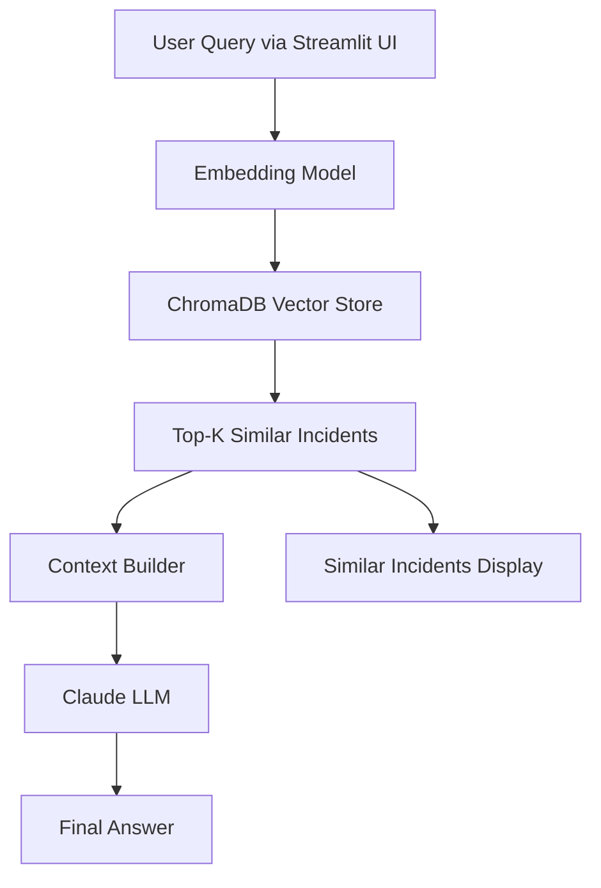

# 🛠️ Smart Incident Knowledge Assistant (RAG)

A lightweight AI-powered troubleshooting assistant that uses **Retrieval-Augmented Generation (RAG)** to help engineers quickly diagnose and resolve incidents using historical alert data.

---

## 🧰 Built With

| Component | Technology |
|---|---|
| Semantic Search | Sentence Transformers |
| Vector Database | ChromaDB |
| LLM Reasoning | Anthropic Claude |
| Chat Interface | Streamlit |

---

## 🚀 Overview

Modern observability platforms like Netcool and BigPanda generate thousands of alerts. Engineers often need to answer:

- Have we seen this issue before?
- What was the root cause?
- How was it resolved?

This project simulates that workflow using a full RAG pipeline.

---

## 🧠 Architecture



---

## 📂 Project Structure

```
incident-rag-assistant/
│
├── data/
│   └── incidents.json
│
├── src/
│   ├── ingest.py
│   ├── retrieve.py
│   ├── rag.py
│   └── app.py
│
├── .streamlit/
│   └── config.toml         # dark mode config
│
├── chroma_db/              # persisted vector store
├── requirements.txt
├── .env                    # API key (not committed to git)
└── README.md
```

---

## ▶️ How to Run

### 1. Clone the Repository

```bash
git clone https://github.com/yourusername/incident-rag-assistant.git
cd incident-rag-assistant
```

### 2. Create a Virtual Environment

```bash
python -m venv .venv
```

Activate it:

```bash
# Windows
.venv\Scripts\activate

# Mac/Linux
source .venv/bin/activate
```

### 3. Install Dependencies

```bash
pip install -r requirements.txt
```

### 4. Add Your API Key

Create a `.env` file in the project root:

```
ANTHROPIC_API_KEY=your_api_key_here
```

### 5. Ingest Incident Data

```bash
python src/ingest.py
```

This will:
- Generate embeddings for each incident
- Store them in ChromaDB
- Persist the vector database locally in `./chroma_db`

### 6. Run the App

```bash
streamlit run src/app.py
```

---

## 💡 Example Queries

- `"High CPU and latency on API service"`
- `"Database connection timeouts"`
- `"Kubernetes pod crash looping"`
- `"Redis cache miss spike"`

---

## ✨ Features

- 🔍 Semantic incident search
- 🤖 RAG-based reasoning with Claude
- 💬 Chat-style UI
- 📊 Confidence scoring and similarity distance
- 💾 Persistent vector database

---

## 📌 Notes on Persistence

ChromaDB stores embeddings locally in `./chroma_db`. You only need to re-run `ingest.py` if:

- The incident dataset changes
- The embedding logic changes
- The `chroma_db` folder is deleted